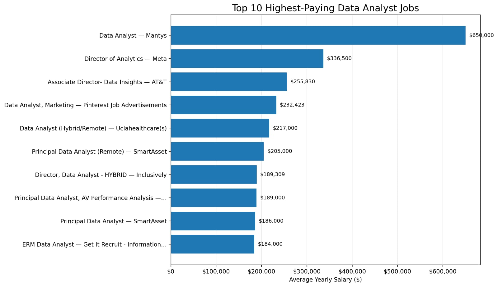

# SQL Job Market Analysis

## Introduction

Dive into the data analyst job market! This project uses SQL to explore data analyst roles, salaries, companies, and in-demand skills.

The goal of this project is to understand the data analyst job market and identify the opportunities and skills that can help aspiring data analysts make better career decisions.

SQL queries? Check them out here: [project_sql folder](./project_sql/)

---

## Background

Driven by a desire to better understand the data analyst job market, this project was built to explore the factors that can help someone navigate their career more effectively.

The analysis focuses on job titles, salaries, locations, companies, and the skills employers are looking for. By using SQL to analyze job posting data, I wanted to turn raw job-market data into useful insights.

### The questions I wanted to answer through my SQL queries were:

1. What are the top-paying data analyst jobs?
2. What skills are required for these top-paying jobs?
3. What skills are most in demand for data analysts?
4. Which skills are associated with higher salaries?
5. What are the most optimal skills to learn?

---

## Tools I Used

- *SQL* – Used to query, filter, join, and analyze the data.
- *PostgreSQL* – Used for working with the job-market database.
- *Visual Studio Code* – Used to write and organize SQL queries.
- *Git* – Used for version control.
- *GitHub* – Used to store, document, and share the project.

---

# The Analysis

Each analysis below focuses on one of the questions I wanted to answer about the data analyst job market.

## 1. Top-Paying Data Analyst Jobs

To identify the highest-paying data analyst opportunities, I filtered the job postings for data analyst roles with available salary information and ranked them by average yearly salary.

This analysis helps highlight the companies and opportunities offering the highest compensation for data analyst positions.

### SQL Query
 
``` sql
SELECT
    job_id,
    job_title,
    job_location,
    job_schedule_type,
    salary_year_avg,
    job_posted_date,
    name AS company_name
FROM job_postings_fact
LEFT JOIN company_dim ON job_postings_fact.company_id = company_dim.company_id
WHERE
    job_title_short = 'Data Analyst'
    AND job_location = 'Anywhere'
    AND salary_year_avg IS NOT NULL
ORDER BY salary_year_avg DESC
LIMIT 10; 
```


### Results
Here's the breakdown of the top Data Analyst jobs:
Wide Salary Range: The top 10 salaries range from $184,000 to $650,000, showing a significant difference in compensation.
Diverse Employers: Companies such as Mantys, Meta, AT&T, SmartAsset, and Motional appear among the highest-paying postings.
Job Title Variety: The results include titles ranging from Data Analyst to Director of Analytics and Principal Data Analyst, showing different levels of responsibility within analytics roles.
 
Bar graph visualizing the salaries for the top 10 highest-paying Data Analyst job postings; generated from my SQL query results.

## `2.Skills Required for Top-Paying Data Analyst Jobs`
  After identifying the hihest-paying data analyst jobs, I analyzed the skills associated with those positions.
The goal was to understand which technical skills appear most frequently among the highest-paying opportunities.

### SQL Querysql

WITH top_paying_jobs AS
``` (
    SELECT
        job_id,
        job_title,
        salary_year_avg,
        name AS company_name
    FROM job_postings_fact
    LEFT JOIN company_dim
        ON job_postings_fact.company_id = company_dim.company_id
    WHERE
        job_title_short = 'Data Analyst'
        AND job_location = 'Anywhere'  
        AND salary_year_avg IS NOT NULL
    ORDER BY salary_year_avg DESC
    limit 10
)

SELECT
    top_paying_jobs.*,
    skills
FROM top_paying_jobs
INNER JOIN skills_job_dim
    ON top_paying_jobs.job_id = skills_job_dim.job_id
INNER JOIN skills_dim
    ON skills_job_dim.skill_id = skills_dim.skill_id
ORDER BY salary_year_avg DESC;
```


See [2_top_paying_job_skills.sql](./project_sql/2_top_paying_job_skills.sql)
## Results
Here's the breakdown of the most common skills required for the top 10 highest-paying Data Analyst jobs:
SQL: SQL is the most frequently required skill, appearing in 8 of the top 10 job postings.
Python: Python is the second most common skill, appearing in 7 job postings.
Tableau: Tableau appears in 6 of the top 10 job postings, highlighting the importance of data visualization skills.
Excel: Excel appears in 4 job postings.
Snowflake, Pandas, and R: Each of these skills appears in 3 job postings.
Azure, Bitbucket, and Go: Each appears in 2 job postings.
Overall: The results show that SQL, Python, and Tableau are the most common skills among the top-paying Data Analyst positions.


## 3. Most In-Demand Skills for Data Analysts

After analyzing the skills associated with data analyst job postings, I wanted to identify which technical skills employers request most frequently.

The goal was to understand the core skills that appear most often across data analyst opportunities and identify the technologies that are most relevant to the job market.

### SQL Query
```
sql
SELECT
    skills,
    COUNT(skills_job_dim.job_id) AS demand_count
FROM job_postings_fact
INNER JOIN skills_job_dim
    ON job_postings_fact.job_id = skills_job_dim.job_id
INNER JOIN skills_dim
    ON skills_job_dim.skill_id = skills_dim.skill_id
WHERE
    job_title_short = 'Data Analyst'
GROUP BY skills
ORDER BY demand_count DESC
LIMIT 25;
```
### Results

| Skills | Demand Count |
|---|---:|
| SQL | 7291 |
| Excel | 4611 |
| Python | 4330 |
| Tableau | 3745 |
| Power BI | 2609 |

Table of the demand for the top 5 skills in Data Analyst job postings


## 4. Skills Associated with Higher Salaries

After identifying the most in-demand skills, I analyzed the average salary associated with each skill.

The goal was to understand which technical skills are associated with higher-paying data analyst positions.

### SQL Query
```
sql
SELECT
    skills,
    ROUND(AVG(salary_year_avg), 0) AS avg_salary
FROM job_postings_fact
INNER JOIN skills_job_dim
    ON job_postings_fact.job_id = skills_job_dim.job_id
INNER JOIN skills_dim
    ON skills_job_dim.skill_id = skills_dim.skill_id
WHERE
    job_title_short = 'Data Analyst'
    AND salary_year_avg IS NOT NULL
GROUP BY skills
ORDER BY avg_salary DESC
LIMIT 25;
```
| Skills | Average Salary ($) |
|---|---:|
| Visio | 119,250 |
| Jira | 119,250 |
| Confluence | 119,250 |
| Power BI | 118,140 |
| Azure | 118,140 |
| PowerPoint | 104,550 |
| Flow | 96,604 |
| Sheets | 93,600 |
| Word | 89,579 |
| SQL | 85,397 |

## Results
Skills such as Visio, Jira, and Confluence are associated with the highest average salary of $119,250. Power BI and Azure follow with an average salary of $118,140, while PowerPoint is associated with $104,550.
This shows that certain specialized skills are associated with higher average salaries in Data Analyst roles.

## 5. Optimal Skills to Learn

Finally, I combined skill demand with average salary to identify skills that offer a strong combination of market demand and earning potential.

The goal was to find skills that are not only associated with competitive salaries but are also requested frequently enough to be relevant in the data analyst job market.

### SQL Query
```
sql
WITH skills_demand AS (
    SELECT
        skills_job_dim.skill_id,
        skills,
        COUNT(skills_job_dim.job_id) AS demand_count
    FROM job_postings_fact
    INNER JOIN skills_job_dim
        ON job_postings_fact.job_id = skills_job_dim.job_id
    INNER JOIN skills_dim
        ON skills_job_dim.skill_id = skills_dim.skill_id
    WHERE
        job_title_short = 'Data Analyst'
        AND salary_year_avg IS NOT NULL
    GROUP BY
        skills_job_dim.skill_id,
        skills
),

average_salary AS (
    SELECT
        skills_job_dim.skill_id,
        skills,
        ROUND(AVG(salary_year_avg), 0) AS avg_salary
    FROM job_postings_fact
    INNER JOIN skills_job_dim
        ON job_postings_fact.job_id = skills_job_dim.job_id
    INNER JOIN skills_dim
        ON skills_job_dim.skill_id = skills_dim.skill_id
    WHERE
        job_title_short = 'Data Analyst'
        AND salary_year_avg IS NOT NULL
    GROUP BY
        skills_job_dim.skill_id,
        skills
)

SELECT
    skills_demand.skills,
    demand_count,
    avg_salary
FROM skills_demand
INNER JOIN average_salary
    ON skills_demand.skill_id = average_salary.skill_id
ORDER BY
    demand_count DESC,
    avg_salary DESC
LIMIT 25;
```

### Results

| Skill ID | Skills | Demand Count | Average Salary ($) |
|---:|---|---:|---:|
| 0 | sql | 398 | $97,237 |
| 181 | excel | 256 | $87,288 |
| 1 | python | 236 | $101,397 |
| 182 | tableau | 230 | $99,288 |
| 5 | r | 148 | $100,499 |
| 183 | power bi | 110 | $97,431 |
| 7 | sas | 63 | $98,902 |
| 186 | sas | 63 | $98,902 |
| 196 | powerpoint | 58 | $88,701 |
| 185 | looker | 49 | $103,795 |
| 188 | word | 48 | $82,576 |
| 80 | snowflake | 37 | $112,948 |
| 79 | oracle | 37 | $104,534 |

Table of the most optimal skills for Data Analysts, combining demand and average salary.

## What I Learned

Working on this project helped me strengthen my practical SQL and data analysis skills.

Some of the key concepts I practiced include:

- Writing complex SQL queries
- Using JOIN statements to combine multiple tables
- Using GROUP BY and aggregate functions to analyze data
- Working with Common Table Expressions (CTEs)
- Filtering and sorting large datasets
- Analyzing job market data
- Comparing skill demand with salary information
- Using SQL to answer real-world business questions

More importantly, this project helped me understand how SQL can be used not just to retrieve data, but to turn raw data into useful insights.


# Conclusions
##        Closing Thoughts

This project strengthened my SQL skills and gave me a better understanding of the Data Analyst job market. The analysis showed that SQL, Excel, and Python are among the most in-demand skills, while certain specialized skills are associated with higher average salaries. These findings can help guide my future learning and career development as I continue building my skills in data analytics.